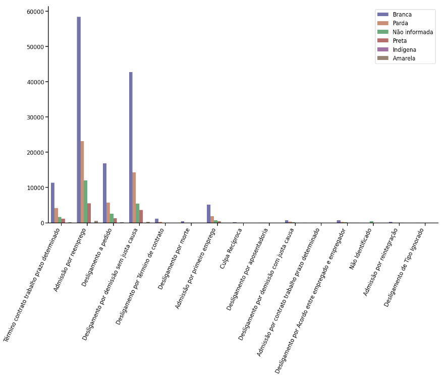

 

<h1 align="center"> Análise de Dados NOVO CAGED - Vale do Paraíba</h1>

 
    <a href="#analise">Disponibilidade dos Dados</a> &nbsp | &nbsp
    <a href="#graficos">Gráficos</a> &nbsp | &nbsp
    <a href="#sobre">Sobre</a> &nbsp | &nbsp

### Municípios do Vale dos Paraíba presentes na pesquisa:

	São José dos Campos ID=354990
	Taubaté ID=355410
	Jacarei ID=352440
	Aparecida ID=350250
	Caçapava ID=350850
	Campos do Jordão ID=350970
	Cachoeira Paulista ID=350860
	Caraguatatuba ID=351050
	Guaratinguetá ID=351840
	Lorena ID=352720
	Pindamonhangaba ID=353800
	São Sebastião ID=355070
	Ubatuba ID=355540

Obs: Análise realizada em cima dos dados de Abril/2020 à Dezembro/2020

## :open_file_folder: Disponibilidade dos Dados

Link: ftp://ftp.mtps.gov.br/pdet/microdados/NOVO%20CAGED/Movimenta%E7%F5es/2020/Dezembro/

	Baixar os seguintes arquivos:

		- CAGEDMOV202004.txt
		- CAGEDMOV202005.txt
		- CAGEDMOV202006.txt
		- CAGEDMOV202007.txt
		- CAGEDMOV202008.txt
		- CAGEDMOV202009.txt
		- CAGEDMOV202010.txt
		- CAGEDMOV202011.txt
		- CAGEDMOV202012.txt

	Com os dados baixados do CAGED coloque-os em um diretório chamado "bases_csv"

OBS: Acessível somente pelo Internet Explorer (Data de acesso: 20/04/2021)

## :bar_chart: Gráficos

### Perguntas

<ol>
	<li><a href="#indices">Qual foi o índice de pessoas empregadas e desempregadas em certo período</a></li>
	<li><a href="#consumo_gastos">Quais foram as estatísticas de consumo/gastos após o aumento ou diminuição do Emprego/Desemprego<a></li>
	<li><a href="#genero">Quantidade de admissões/demissões por gênero no período da pandemia<a></li>
	<li><a href="#tipo_movimentacao">Diferenças Salariais<a></li>
	<li><a href="#causas">Visualizar as causas de admissão/demissão formalizadas pelos empregadores<a></li>
</ol>

### Perguntas Adicionais

<ol>
	<li><a href="#diferenca_salario_escolaridade_raca_cor">Diferença salarial por escolaridade e raça/cor<a></li>
	<li><a href="#diferenca_escolaridade_raca_cor">Diferença de escolaridade por raça/cor<a></li>
	<li><a href="#dificiencia_fisica">Quantidade de admissões e demissões por tipo de deficiência<a></li>
	<li><a href="#primeiro_emp_setor_salario">Média salarial inicial das pessoas que tiveram seu primeiro emprego durante um certo período e de quais setores<a></li>
</ol>

<!-- INDICES -->

 

### Qual foi o índice de pessoas empregadas e desempregadas no período, categorizadas por

#### Classe Social

  

 

#### Faixa Etária

  

 

#### Nível Escolaridade

  

 

#### Setores

  

 

#### Geral

  

 

→ [Voltar as perguntas](#graficos)

<!-- CONSUMO GASTOS -->

### Quais foram as estatísticas de consumo/gastos após o aumento ou diminuição do Emprego/Desemprego

#### Admissões/Demissões por Mês (Abril-Dezembro 2020)

  

 

#### Impostos Mensais

  

 

→ [Voltar as perguntas](#graficos)

<!-- GENERO -->

### Quantidade de admissões/demissões por gênero no período da pandemia

  

 

→ [Voltar as perguntas](#graficos)

<!-- TIPO MOVIMENTACAO -->

### Diferenças Salariais

#### Diferença salarial entre homens e mulheres admitidos

  

 

#### Diferença salarial entre homens e mulheres demitidos

  

 

#### Média salarial por raça/cor

  

→ [Voltar as perguntas](#graficos)

### Visualizar as causas de admissão/demissão formalizadas pelos empregadores

#### Sexo

  

 

#### Raça/Cor

  

 

#### Faixa Etária

  

 

#### Setores

  

 

→ [Voltar as perguntas](#graficos)

### Diferença salarial por escolaridade e raça/cor

  

 

→ [Voltar as perguntas](#graficos)

### Diferença de escolaridade por raça/cor

  

 

→ [Voltar as perguntas](#graficos)

### Quantidade de admissões e demissões por tipo de deficiência

#### Gráfico Sunburst

  

 

#### Gráfico Barras

  

 

→ [Voltar as perguntas](#graficos)

### Média salarial inicial das pessoas que tiveram seu primeiro emprego durante um certo período e de quais setores

#### Média Salarial Primeiro Emprego

  

 

#### Primeiro Emprego por Setor

  

 

→ [Voltar as perguntas](#graficos)

## :busts_in_silhouette: Sobre

Análise realizada para matéria de Laboratório de Banco de Dados FATEC São José dos Campos

- Professor: Fernando Massanori

- Aluno: Eduardo Ferreira Rumbelsperger Querido

→ [Voltar ao topo](#topo)